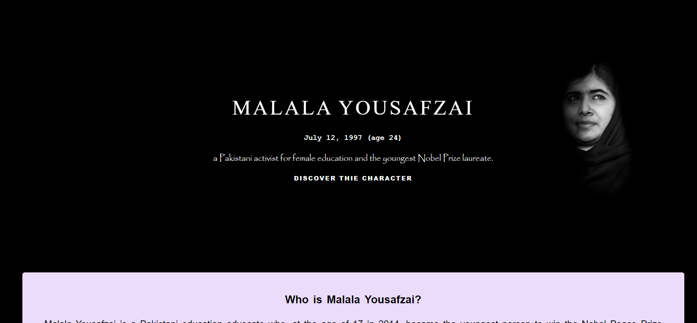

# Malala-Tribute-Page
A tribute page dedicated to MALALA YOUSAFZAI .

This page is build using plain HTML and CSS.  There's no JavaScript involved. Below is a link of the page. 

#### Demo Image 🖼:

## LIVE DEMO.[TRY NOW](https://hawra-alramadan.github.io/Malala-Tribute-Page/) ♥

### 💡NOTE :
 This page is for educational purpose.
 

## Acknowledgements

 - [Awesome Readme Templates](https://awesomeopensource.com/project/elangosundar/awesome-README-templates)
 - [Awesome README](https://github.com/matiassingers/awesome-readme)
 - [How to write a Good readme](https://bulldogjob.com/news/449-how-to-write-a-good-readme-for-your-github-project)

## Authors

 [hawra-alramadan](https://github.com/hawra-alramadan)

# 🔐LICENSE:
©  Copyright 2022 

